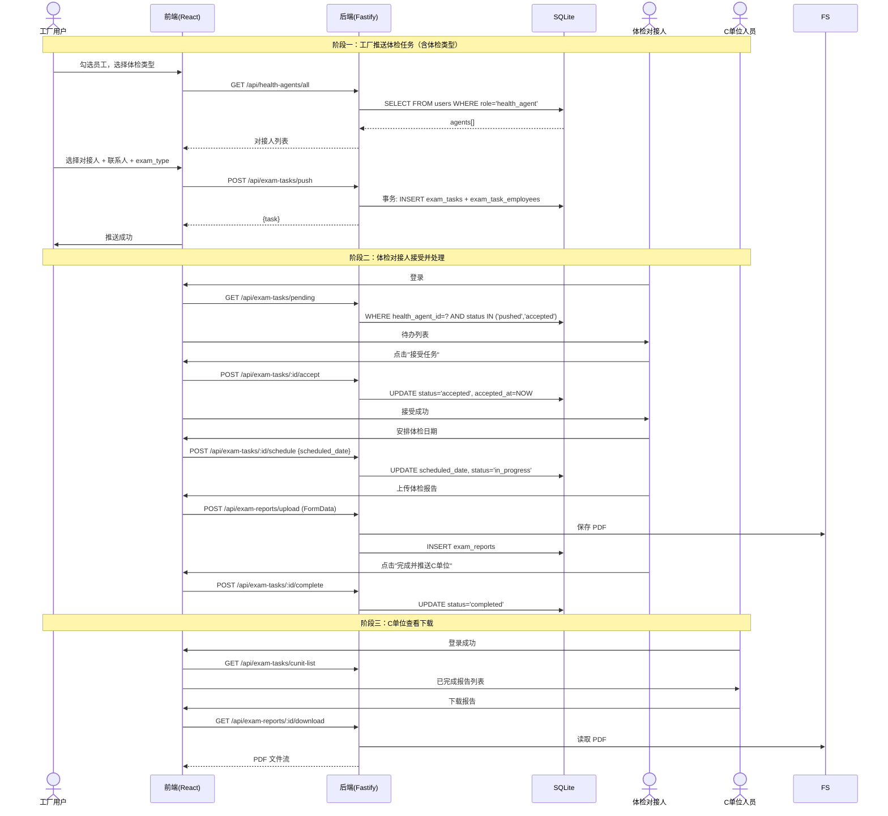
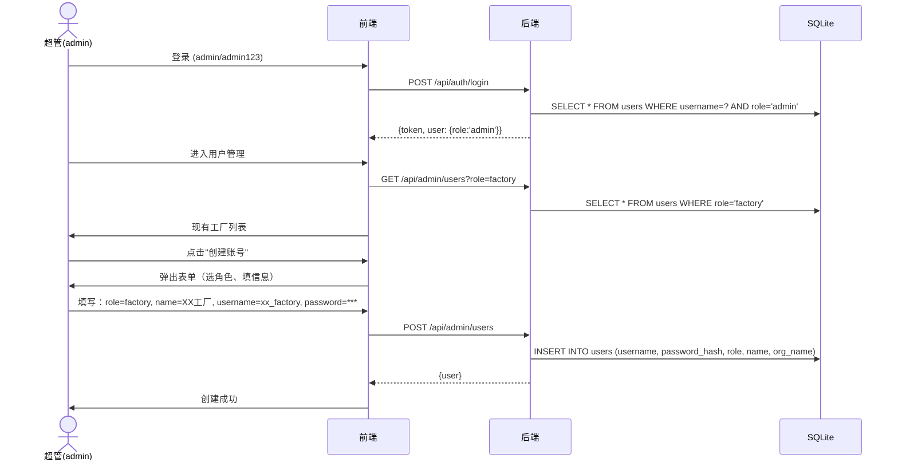
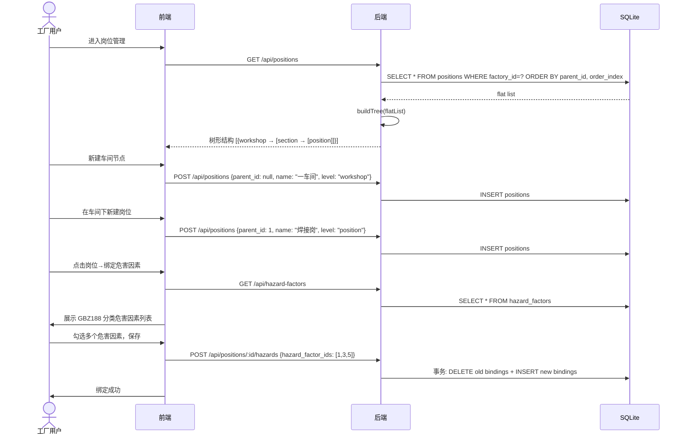
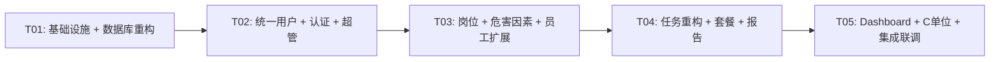

# 职业健康体检管理平台 — 全面重构架构设计 V2

**文档版本**：v2.0  
**创建日期**：2026-06-03  
**架构师**：Bob  
**重构基线**：architecture.md v1.0 → 统一用户体系 + 岗位危害 + 体检套餐

---

## 1. 实现方案概述

### 1.1 核心变更

| 维度 | 现状 (v1) | 重构后 (v2) |
|------|-----------|-------------|
| 用户体系 | 4 张独立表（factories / health_agents / c_unit_agents / admins） | 统一 `users` 表，role 字段区分 |
| 登录方式 | 三角色各自独立登录接口 | 统一 `/api/auth/login` + 手机验证码分流 |
| 账号管理 | 各表独立管理 | 超管统一创建/管理所有角色子账号 |
| 岗位结构 | employees.position 纯文本字段 | `positions` 自引用树（车间 → 工段 → 岗位） |
| 危害因素 | 无 | `hazard_factors`（GBZ188 分类）+ `position_hazards` 多对多 |
| 员工扩展 | 基本字段 | 新增 gender / birth_date / entry_date / hazard_start_date / position_id |
| 体检任务 | pushed / in_progress / completed | 新增 exam_type 字段 + accepted 状态 |
| 体检套餐 | 无 | `exam_packages` 表，体检中心维护模板 |
| Dashboard | 无统计数据 | 四角色独立统计看板 |

### 1.2 技术栈（保持不变）

| 层次 | 技术 | 说明 |
|------|------|------|
| 前端 | Vite + React 18 + MUI 5 + Tailwind CSS | 保持不变 |
| 后端 | Node.js + Fastify 4 | 保持不变 |
| 数据库 | SQLite（better-sqlite3） | 保持不变，新增迁移脚本 |
| 认证 | JWT（jsonwebtoken）+ bcryptjs | 统一 users 表 |
| 文件存储 | 本地文件系统（uploads/） | 保持不变 |

### 1.3 架构模式

- **后端**：分层架构（Route → Service → Repository），中间件统一鉴权
- **前端**：SPA + 角色路由守卫，四角色各自独立路由分组
- **认证**：统一 JWT token 携带 `{id, role}`，中间件按 role 鉴权
- **权限隔离**：Repository 层 WHERE 条件强制数据隔离（factory_id / health_agent_id）

---

## 2. 完整数据库设计

### 2.1 新表结构（完整 CREATE TABLE SQL）

```sql
-- ============================================================
-- 1. 统一用户表（替代 factories / health_agents / c_unit_agents / admins）
-- ============================================================
CREATE TABLE IF NOT EXISTS users (
  id INTEGER PRIMARY KEY AUTOINCREMENT,
  username TEXT NOT NULL UNIQUE,
  password_hash TEXT NOT NULL,
  role TEXT NOT NULL CHECK(role IN ('admin', 'factory', 'health_agent', 'c_unit')),
  name TEXT NOT NULL,
  org_name TEXT DEFAULT '',
  phone TEXT DEFAULT '',
  status TEXT NOT NULL DEFAULT 'active' CHECK(status IN ('active', 'disabled')),
  org_id INTEGER DEFAULT NULL,
  created_at DATETIME DEFAULT CURRENT_TIMESTAMP,
  updated_at DATETIME DEFAULT CURRENT_TIMESTAMP
);

-- ============================================================
-- 2. 工厂联系人表（FK 指向 users 而非 factories）
-- ============================================================
CREATE TABLE IF NOT EXISTS factory_contacts (
  id INTEGER PRIMARY KEY AUTOINCREMENT,
  factory_id INTEGER NOT NULL,
  name TEXT NOT NULL,
  position TEXT DEFAULT '',
  phone TEXT NOT NULL,
  created_at DATETIME DEFAULT CURRENT_TIMESTAMP,
  FOREIGN KEY (factory_id) REFERENCES users(id) ON DELETE CASCADE
);

-- ============================================================
-- 3. 岗位表（自引用树：车间 → 工段 → 岗位）
-- ============================================================
CREATE TABLE IF NOT EXISTS positions (
  id INTEGER PRIMARY KEY AUTOINCREMENT,
  factory_id INTEGER NOT NULL,
  parent_id INTEGER DEFAULT NULL,
  name TEXT NOT NULL,
  level TEXT NOT NULL CHECK(level IN ('workshop', 'section', 'position')),
  order_index INTEGER DEFAULT 0,
  created_at DATETIME DEFAULT CURRENT_TIMESTAMP,
  FOREIGN KEY (factory_id) REFERENCES users(id) ON DELETE CASCADE,
  FOREIGN KEY (parent_id) REFERENCES positions(id) ON DELETE SET NULL
);

-- ============================================================
-- 4. 危害因素表（GBZ188 分类）
-- ============================================================
CREATE TABLE IF NOT EXISTS hazard_factors (
  id INTEGER PRIMARY KEY AUTOINCREMENT,
  code TEXT NOT NULL UNIQUE,
  category TEXT NOT NULL,
  name TEXT NOT NULL,
  description TEXT DEFAULT '',
  exam_frequency TEXT DEFAULT '',
  created_at DATETIME DEFAULT CURRENT_TIMESTAMP
);

-- ============================================================
-- 5. 岗位-危害因素绑定表（多对多）
-- ============================================================
CREATE TABLE IF NOT EXISTS position_hazards (
  id INTEGER PRIMARY KEY AUTOINCREMENT,
  position_id INTEGER NOT NULL,
  hazard_factor_id INTEGER NOT NULL,
  FOREIGN KEY (position_id) REFERENCES positions(id) ON DELETE CASCADE,
  FOREIGN KEY (hazard_factor_id) REFERENCES hazard_factors(id) ON DELETE CASCADE,
  UNIQUE(position_id, hazard_factor_id)
);

-- ============================================================
-- 6. 员工表（扩展字段 + position_id FK）
-- ============================================================
CREATE TABLE IF NOT EXISTS employees (
  id INTEGER PRIMARY KEY AUTOINCREMENT,
  factory_id INTEGER NOT NULL,
  name TEXT NOT NULL,
  gender TEXT DEFAULT '' CHECK(gender IN ('', 'male', 'female')),
  birth_date DATE DEFAULT NULL,
  id_card TEXT NOT NULL,
  phone TEXT DEFAULT '',
  position_id INTEGER DEFAULT NULL,
  entry_date DATE DEFAULT NULL,
  hazard_start_date DATE DEFAULT NULL,
  created_at DATETIME DEFAULT CURRENT_TIMESTAMP,
  updated_at DATETIME DEFAULT CURRENT_TIMESTAMP,
  FOREIGN KEY (factory_id) REFERENCES users(id) ON DELETE CASCADE,
  FOREIGN KEY (position_id) REFERENCES positions(id) ON DELETE SET NULL
);

-- ============================================================
-- 7. 体检任务表（新增 exam_type + accepted 状态）
-- ============================================================
CREATE TABLE IF NOT EXISTS exam_tasks (
  id INTEGER PRIMARY KEY AUTOINCREMENT,
  factory_id INTEGER NOT NULL,
  health_agent_id INTEGER NOT NULL,
  factory_contact_id INTEGER DEFAULT NULL,
  exam_type TEXT NOT NULL DEFAULT 'periodic'
    CHECK(exam_type IN ('pre_employment', 'periodic', 'pre_resignation', 'emergency')),
  status TEXT NOT NULL DEFAULT 'pushed'
    CHECK(status IN ('pushed', 'accepted', 'in_progress', 'completed')),
  pushed_at DATETIME DEFAULT CURRENT_TIMESTAMP,
  accepted_at DATETIME DEFAULT NULL,
  scheduled_date DATE DEFAULT NULL,
  completed_at DATETIME DEFAULT NULL,
  created_at DATETIME DEFAULT CURRENT_TIMESTAMP,
  FOREIGN KEY (factory_id) REFERENCES users(id),
  FOREIGN KEY (health_agent_id) REFERENCES users(id),
  FOREIGN KEY (factory_contact_id) REFERENCES factory_contacts(id)
);

-- ============================================================
-- 8. 体检任务-员工关联表
-- ============================================================
CREATE TABLE IF NOT EXISTS exam_task_employees (
  id INTEGER PRIMARY KEY AUTOINCREMENT,
  exam_task_id INTEGER NOT NULL,
  employee_id INTEGER NOT NULL,
  exam_status TEXT NOT NULL DEFAULT 'pending' CHECK(exam_status IN ('pending', 'examined')),
  FOREIGN KEY (exam_task_id) REFERENCES exam_tasks(id) ON DELETE CASCADE,
  FOREIGN KEY (employee_id) REFERENCES employees(id) ON DELETE CASCADE
);

-- ============================================================
-- 9. 体检报告表
-- ============================================================
CREATE TABLE IF NOT EXISTS exam_reports (
  id INTEGER PRIMARY KEY AUTOINCREMENT,
  exam_task_id INTEGER NOT NULL,
  employee_id INTEGER NOT NULL,
  file_path TEXT NOT NULL,
  original_name TEXT NOT NULL,
  file_size INTEGER DEFAULT 0,
  uploaded_by INTEGER NOT NULL,
  uploaded_at DATETIME DEFAULT CURRENT_TIMESTAMP,
  FOREIGN KEY (exam_task_id) REFERENCES exam_tasks(id) ON DELETE CASCADE,
  FOREIGN KEY (employee_id) REFERENCES employees(id) ON DELETE CASCADE,
  FOREIGN KEY (uploaded_by) REFERENCES users(id)
);

-- ============================================================
-- 10. 体检套餐模板表
-- ============================================================
CREATE TABLE IF NOT EXISTS exam_packages (
  id INTEGER PRIMARY KEY AUTOINCREMENT,
  health_agent_id INTEGER NOT NULL,
  name TEXT NOT NULL,
  description TEXT DEFAULT '',
  price DECIMAL(10,2) DEFAULT 0,
  exam_items TEXT DEFAULT '',
  is_active INTEGER DEFAULT 1 CHECK(is_active IN (0, 1)),
  created_at DATETIME DEFAULT CURRENT_TIMESTAMP,
  updated_at DATETIME DEFAULT CURRENT_TIMESTAMP,
  FOREIGN KEY (health_agent_id) REFERENCES users(id) ON DELETE CASCADE
);

-- ============================================================
-- 11. 短信验证码临时表
-- ============================================================
CREATE TABLE IF NOT EXISTS sms_codes (
  id INTEGER PRIMARY KEY AUTOINCREMENT,
  phone TEXT NOT NULL,
  code TEXT NOT NULL,
  expire_at DATETIME NOT NULL,
  created_at DATETIME DEFAULT CURRENT_TIMESTAMP
);

PRAGMA foreign_keys = ON;
```

### 2.2 索引设计

```sql
-- users 表索引
CREATE INDEX IF NOT EXISTS idx_users_role ON users(role);
CREATE INDEX IF NOT EXISTS idx_users_status ON users(status);
CREATE INDEX IF NOT EXISTS idx_users_org_id ON users(org_id);
CREATE INDEX IF NOT EXISTS idx_users_phone ON users(phone);

-- factory_contacts 索引
CREATE INDEX IF NOT EXISTS idx_factory_contacts_factory ON factory_contacts(factory_id);

-- positions 表索引
CREATE INDEX IF NOT EXISTS idx_positions_factory ON positions(factory_id);
CREATE INDEX IF NOT EXISTS idx_positions_parent ON positions(parent_id);
CREATE INDEX IF NOT EXISTS idx_positions_level ON positions(factory_id, level);

-- hazard_factors 表索引
CREATE INDEX IF NOT EXISTS idx_hazard_factors_category ON hazard_factors(category);
CREATE INDEX IF NOT EXISTS idx_hazard_factors_code ON hazard_factors(code);

-- position_hazards 表索引
CREATE INDEX IF NOT EXISTS idx_position_hazards_position ON position_hazards(position_id);
CREATE INDEX IF NOT EXISTS idx_position_hazards_hazard ON position_hazards(hazard_factor_id);

-- employees 表索引
CREATE INDEX IF NOT EXISTS idx_employees_factory ON employees(factory_id);
CREATE INDEX IF NOT EXISTS idx_employees_position ON employees(position_id);
CREATE INDEX IF NOT EXISTS idx_employees_name ON employees(factory_id, name);
CREATE INDEX IF NOT EXISTS idx_employees_id_card ON employees(id_card);

-- exam_tasks 表索引
CREATE INDEX IF NOT EXISTS idx_exam_tasks_factory ON exam_tasks(factory_id);
CREATE INDEX IF NOT EXISTS idx_exam_tasks_agent ON exam_tasks(health_agent_id);
CREATE INDEX IF NOT EXISTS idx_exam_tasks_status ON exam_tasks(status);
CREATE INDEX IF NOT EXISTS idx_exam_tasks_type ON exam_tasks(exam_type);
CREATE INDEX IF NOT EXISTS idx_exam_tasks_agent_status ON exam_tasks(health_agent_id, status);

-- exam_task_employees 索引
CREATE INDEX IF NOT EXISTS idx_exam_task_emp_task ON exam_task_employees(exam_task_id);
CREATE INDEX IF NOT EXISTS idx_exam_task_emp_employee ON exam_task_employees(employee_id);

-- exam_reports 索引
CREATE INDEX IF NOT EXISTS idx_exam_reports_task ON exam_reports(exam_task_id);
CREATE INDEX IF NOT EXISTS idx_exam_reports_employee ON exam_reports(employee_id);
CREATE INDEX IF NOT EXISTS idx_exam_reports_uploader ON exam_reports(uploaded_by);

-- exam_packages 索引
CREATE INDEX IF NOT EXISTS idx_exam_packages_agent ON exam_packages(health_agent_id);

-- sms_codes 索引
CREATE INDEX IF NOT EXISTS idx_sms_codes_phone ON sms_codes(phone);
CREATE INDEX IF NOT EXISTS idx_sms_codes_expire ON sms_codes(expire_at);
```

### 2.3 数据迁移说明

由于表结构从多表合并为统一 `users` 表，迁移策略如下：

1. **新建完整 v2 表结构**（init.js 重写）
2. **创建 seed.js**：插入默认 admin（admin/admin123）和 GBZ188 危害因素字典数据
3. **删除旧数据文件** `data/occupational_health.db` 重新初始化
4. **旧表不保留迁移**——由于重构范围大（表合并 + 新字段 + 新表），采用全新数据库初始化策略

---

## 3. 文件列表

### 3.1 后端文件（server/）

```
server/
├── package.json                          [MODIFY] 新增依赖声明
├── .env                                  [MODIFY] 新增 ADMIN_SEED_PASSWORD
├── index.js                              [MODIFY] 注册新路由
├── db/
│   ├── init.js                           [REWRITE] 全部新表 + 索引
│   └── seed.js                           [REWRITE] admin 种子 + GBZ188 字典 + 示例数据
├── middleware/
│   ├── auth.js                           [MODIFY] users 表统一查询
│   └── roleGuard.js                      [KEEP] 不变
├── routes/
│   ├── auth.js                           [REWRITE] 统一登录 /api/auth/login + /api/auth/send-code
│   ├── admin.js                          [NEW] 超管用户管理 CRUD
│   ├── employee.js                       [MODIFY] 新增字段 + 批量导入
│   ├── position.js                       [NEW] 岗位树 CRUD + 危害因素绑定
│   ├── hazardFactor.js                   [NEW] 危害因素管理
│   ├── factoryContact.js                 [MODIFY] FK 指向 users
│   ├── healthAgent.js                    [MODIFY] 对接人查询（users 表）
│   ├── examTask.js                       [MODIFY] exam_type + accept 接口
│   ├── examReport.js                     [MODIFY] uploaded_by FK
│   ├── examPackage.js                    [NEW] 体检套餐模板 CRUD
│   ├── dashboard.js                      [NEW] 四角色统计接口
│   └── cUnit.js                          [MODIFY] users 表查询
├── services/
│   ├── authService.js                    [MODIFY] 统一 users 认证
│   ├── userService.js                    [NEW] 用户管理业务逻辑
│   ├── employeeService.js                [MODIFY] 新字段处理 + 导入逻辑
│   ├── positionService.js                [NEW] 岗位树构建逻辑
│   ├── hazardFactorService.js            [NEW] 危害因素业务
│   ├── factoryContactService.js          [MODIFY] users FK
│   ├── examTaskService.js                [MODIFY] accept 流程 + exam_type
│   ├── examReportService.js              [MODIFY] uploaded_by
│   ├── examPackageService.js             [NEW] 套餐模板业务
│   ├── dashboardService.js               [NEW] 统计数据聚合
│   └── notificationService.js            [KEEP] 不变
├── repositories/
│   ├── userRepo.js                       [NEW] 统一用户数据访问（替代 4 个旧 Repo）
│   ├── employeeRepo.js                   [MODIFY] 新字段查询
│   ├── positionRepo.js                   [NEW] 岗位树递归查询
│   ├── hazardFactorRepo.js               [NEW] 危害因素 + 绑定
│   ├── factoryContactRepo.js             [MODIFY] users FK
│   ├── examTaskRepo.js                   [MODIFY] 新字段 + accept 操作
│   ├── examReportRepo.js                 [MODIFY] uploaded_by
│   ├── examPackageRepo.js                [NEW] 套餐模板 CRUD
│   └── dashboardRepo.js                  [NEW] 统计查询聚合
└── utils/
    ├── response.js                       [KEEP] 不变
    ├── sms.js                            [KEEP] 不变
    └── fileUpload.js                     [KEEP] 不变
```

### 3.2 前端文件（client/src/）

```
client/
├── package.json                          [MODIFY] 可加 xlsx 等依赖
├── vite.config.js                        [KEEP]
├── tailwind.config.js                    [KEEP]
├── postcss.config.js                     [KEEP]
├── index.html                            [KEEP]
├── src/
│   ├── main.jsx                          [KEEP]
│   ├── App.jsx                           [MODIFY] 新增 admin + 各角色路由
│   ├── theme.js                          [KEEP]
│   ├── api/
│   │   ├── client.js                     [KEEP] 不变
│   │   ├── auth.js                       [MODIFY] 统一登录接口
│   │   ├── employee.js                   [MODIFY] 新字段
│   │   ├── position.js                   [NEW] 岗位 API
│   │   ├── hazardFactor.js               [NEW] 危害因素 API
│   │   ├── factoryContact.js             [MODIFY]
│   │   ├── examTask.js                   [MODIFY] accept + exam_type
│   │   ├── examReport.js                 [KEEP]
│   │   ├── examPackage.js                [NEW] 套餐 API
│   │   ├── dashboard.js                  [NEW] 统计 API
│   │   ├── admin.js                      [NEW] 超管 API
│   │   └── cUnit.js                      [MODIFY]
│   ├── hooks/
│   │   ├── useAuth.js                    [MODIFY] roles 扩展
│   │   └── useRole.js                    [MODIFY] 新增 admin 判断
│   ├── contexts/
│   │   └── AuthContext.jsx               [MODIFY] 角色扩展
│   ├── components/
│   │   ├── Layout.jsx                    [MODIFY] 四角色导航
│   │   ├── AppLayout.jsx                 [MODIFY] admin 侧边栏
│   │   ├── ProtectedRoute.jsx            [KEEP]
│   │   ├── ConfirmDialog.jsx             [KEEP]
│   │   ├── FileUploader.jsx              [KEEP]
│   │   ├── PageHeader.jsx                [NEW] 通用页面标题组件
│   │   ├── StatCard.jsx                  [NEW] 统计卡片组件
│   │   └── TreeSelect.jsx                [NEW] 岗位树选择器
│   ├── pages/
│   │   ├── Login.jsx                     [MODIFY] 统一登录入口
│   │   ├── admin/
│   │   │   ├── Dashboard.jsx             [NEW] 超管统计看板
│   │   │   ├── UserList.jsx              [NEW] 用户管理列表
│   │   │   ├── UserForm.jsx              [NEW] 用户创建/编辑表单
│   │   │   └── HazardFactorList.jsx      [NEW] 危害因素字典管理
│   │   ├── factory/
│   │   │   ├── Dashboard.jsx             [REWRITE] 统计看板
│   │   │   ├── EmployeeList.jsx          [MODIFY] 新字段展示
│   │   │   ├── EmployeeForm.jsx          [MODIFY] 新字段表单 + 岗位选择
│   │   │   ├── PositionManage.jsx        [NEW] 岗位树管理
│   │   │   ├── PushTaskDialog.jsx        [MODIFY] exam_type 选择
│   │   │   ├── PushHistory.jsx           [MODIFY] 新状态展示
│   │   │   └── ContactManage.jsx         [MODIFY]
│   │   ├── healthAgent/
│   │   │   ├── Dashboard.jsx             [REWRITE] 统计看板
│   │   │   ├── TaskList.jsx              [MODIFY] accept 操作
│   │   │   ├── TaskDetail.jsx            [MODIFY] exam_type 展示
│   │   │   ├── ReportUpload.jsx          [KEEP]
│   │   │   ├── CompleteConfirm.jsx       [KEEP]
│   │   │   ├── History.jsx               [MODIFY] 筛选扩展
│   │   │   └── PackageManage.jsx         [NEW] 套餐模板管理
│   │   └── cUnit/
│   │       ├── Dashboard.jsx             [REWRITE] 统计看板
│   │       ├── ReportList.jsx            [MODIFY] 筛选扩展
│   │       ├── EmployeeDetail.jsx        [MODIFY] 新字段展示
│   │       └── ReportViewer.jsx          [KEEP]
│   └── styles/
│       └── globals.css                   [KEEP]
```

---

## 4. API 端点

### 4.1 认证模块

| 方法 | 路径 | 请求体 | 权限 | 说明 |
|------|------|--------|------|------|
| POST | `/api/auth/login` | `{username, password}` 或 `{phone, code}` | 公开 | 统一登录（admin/factory/c_unit 用账号密码；health_agent 可用手机验证码） |
| POST | `/api/auth/send-code` | `{phone}` | 公开 | 发送手机验证码（模拟 123456） |
| GET | `/api/auth/me` | - | 登录 | 获取当前用户信息 `{id, role, name, org_name}` |

### 4.2 超管 - 用户管理

| 方法 | 路径 | 请求体 | 权限 | 说明 |
|------|------|--------|------|------|
| GET | `/api/admin/users` | query: `page, pageSize, role, keyword` | admin | 用户列表（分页+筛选） |
| POST | `/api/admin/users` | `{username, password, role, name, org_name, phone}` | admin | 创建任意角色子账号 |
| GET | `/api/admin/users/:id` | - | admin | 用户详情 |
| PUT | `/api/admin/users/:id` | `{name, org_name, phone}` | admin | 编辑用户信息 |
| PUT | `/api/admin/users/:id/password` | `{password}` | admin | 重置密码 |
| PUT | `/api/admin/users/:id/status` | `{status: "active"\|"disabled"}` | admin | 启用/禁用账号 |
| DELETE | `/api/admin/users/:id` | - | admin | 删除用户 |

### 4.3 超管 - 危害因素字典

| 方法 | 路径 | 请求体 | 权限 | 说明 |
|------|------|--------|------|------|
| GET | `/api/hazard-factors` | query: `category, keyword` | admin | 危害因素列表 |
| POST | `/api/hazard-factors` | `{code, category, name, description, exam_frequency}` | admin | 新增危害因素 |
| PUT | `/api/hazard-factors/:id` | `{code, category, name, description, exam_frequency}` | admin | 编辑危害因素 |
| DELETE | `/api/hazard-factors/:id` | - | admin | 删除危害因素 |

### 4.4 工厂 - 岗位管理

| 方法 | 路径 | 请求体 | 权限 | 说明 |
|------|------|--------|------|------|
| GET | `/api/positions` | - | factory | 获取本厂岗位树（含危害因素） |
| POST | `/api/positions` | `{parent_id, name, level}` | factory | 创建岗位节点（车间/工段/岗位） |
| PUT | `/api/positions/:id` | `{name, parent_id, order_index}` | factory | 编辑岗位节点 |
| DELETE | `/api/positions/:id` | - | factory | 删除岗位节点（级联子节点） |
| GET | `/api/positions/:id/hazards` | - | factory | 获取岗位绑定的危害因素 |
| POST | `/api/positions/:id/hazards` | `{hazard_factor_ids: []}` | factory | 绑定危害因素到岗位 |
| DELETE | `/api/positions/:id/hazards/:hazardId` | - | factory | 解绑单个危害因素 |

### 4.5 工厂 - 员工管理（扩展字段）

| 方法 | 路径 | 请求体 | 权限 | 说明 |
|------|------|--------|------|------|
| GET | `/api/employees` | query: `page, pageSize, keyword, position_id` | factory | 员工列表（按岗位筛选） |
| GET | `/api/employees/:id` | - | factory | 员工详情（含岗位路径） |
| POST | `/api/employees` | `{name, gender, birth_date, id_card, phone, position_id, entry_date, hazard_start_date}` | factory | 新增员工 |
| PUT | `/api/employees/:id` | 同 POST | factory | 编辑员工 |
| DELETE | `/api/employees/:id` | - | factory | 删除员工 |
| POST | `/api/employees/import` | FormData: `{file}` | factory | Excel 批量导入 |

### 4.6 工厂 - 联系人管理

| 方法 | 路径 | 请求体 | 权限 | 说明 |
|------|------|--------|------|------|
| GET | `/api/factory-contacts` | - | factory | 本厂联系人列表 |
| POST | `/api/factory-contacts` | `{name, position, phone}` | factory | 新增联系人 |
| PUT | `/api/factory-contacts/:id` | `{name, position, phone}` | factory | 编辑联系人 |
| DELETE | `/api/factory-contacts/:id` | - | factory | 删除联系人 |

### 4.7 体检中心对接人 - 查询

| 方法 | 路径 | 请求体 | 权限 | 说明 |
|------|------|--------|------|------|
| GET | `/api/health-agents` | - | factory | 工厂获取已建立任务的对接人列表（仅可见范围） |
| GET | `/api/health-agents/all` | - | factory | 获取全部对接人（推送选择） |

### 4.8 体检任务（重构）

| 方法 | 路径 | 请求体 | 权限 | 说明 |
|------|------|--------|------|------|
| POST | `/api/exam-tasks/push` | `{health_agent_id, factory_contact_id, employee_ids, exam_type}` | factory | 工厂推送 + 指定体检类型 |
| POST | `/api/exam-tasks/:id/accept` | - | health_agent | 对接人接受任务 → status=accepted |
| POST | `/api/exam-tasks/:id/schedule` | `{scheduled_date}` | health_agent | 安排体检日期 |
| GET | `/api/exam-tasks/:id` | - | factory / health_agent | 任务详情（含员工+报告） |
| POST | `/api/exam-tasks/:id/complete` | - | health_agent | 完成+推送 C 单位 → status=completed |
| GET | `/api/exam-tasks/pushed` | query: `page, pageSize, exam_type` | factory | 工厂推送历史 |
| GET | `/api/exam-tasks/pending` | query: `page, pageSize` | health_agent | 待办任务（pushed + accepted） |
| GET | `/api/exam-tasks/history` | query: `page, pageSize` | health_agent | 已完成历史 |
| GET | `/api/exam-tasks/cunit-list` | query: `page, pageSize, factory_name, keyword` | c_unit | C 单位任务列表 |

### 4.9 体检报告

| 方法 | 路径 | 请求体 | 权限 | 说明 |
|------|------|--------|------|------|
| POST | `/api/exam-reports/upload` | FormData: `{task_id, employee_id, file}` | health_agent | 上传 PDF 报告 |
| GET | `/api/exam-reports/task/:taskId` | - | 角色权限 | 任务下所有报告 |
| GET | `/api/exam-reports/:id` | - | 角色权限 | 报告详情 |
| GET | `/api/exam-reports/:id/download` | - | 角色权限 | 下载 PDF |
| DELETE | `/api/exam-reports/:id` | - | health_agent | 删除报告 |

### 4.10 体检套餐模板

| 方法 | 路径 | 请求体 | 权限 | 说明 |
|------|------|--------|------|------|
| GET | `/api/exam-packages` | - | health_agent | 本体检中心套餐列表 |
| POST | `/api/exam-packages` | `{name, description, price, exam_items}` | health_agent | 新增套餐模板 |
| PUT | `/api/exam-packages/:id` | `{name, description, price, exam_items, is_active}` | health_agent | 编辑套餐 |
| DELETE | `/api/exam-packages/:id` | - | health_agent | 删除套餐 |

### 4.11 统计看板

| 方法 | 路径 | 请求体 | 权限 | 说明 |
|------|------|--------|------|------|
| GET | `/api/dashboard/admin` | - | admin | 超管看板（用户数/任务数/完成率） |
| GET | `/api/dashboard/factory` | - | factory | 工厂看板（员工数/任务状态分布/到期预警） |
| GET | `/api/dashboard/health-agent` | - | health_agent | 体检中心看板（待办数/本月完成/报告数） |
| GET | `/api/dashboard/c-unit` | - | c_unit | C 单位看板（接收报告数/按工厂统计） |

---

## 5. 程序调用流程

### 5.1 核心流程：工厂推送 → 接受 → 完成



### 5.2 超管创建子账号流程



### 5.3 工厂管理岗位树 + 绑定危害因素



---

## 6. 任务列表（按实现顺序）

### T01：项目基础设施 + 数据库重构

**Task ID**：T01  
**描述**：重写数据库初始化脚本（全部新表+索引），创建种子数据（超管账号 + GBZ188 字典），更新 package.json 依赖声明，修改 .env 配置文件，更新后端入口注册新路由模块。

**包含文件**：
- `server/package.json` [MODIFY]
- `server/.env` [MODIFY]
- `server/index.js` [MODIFY]
- `server/db/init.js` [REWRITE]
- `server/db/seed.js` [REWRITE]
- `server/middleware/auth.js` [MODIFY]
- `server/utils/response.js` [KEEP]

**依赖**：无  
**优先级**：P0

---

### T02：统一用户体系 + 认证重构 + 超管用户管理

**Task ID**：T02  
**描述**：实现统一 users 表的数据访问层、认证服务（统一登录/验证码/me）、超管用户管理 CRUD。前端实现统一登录页、超管看板与用户管理页面、认证上下文扩展。

**包含文件**：
- `server/repositories/userRepo.js` [NEW]
- `server/services/authService.js` [REWRITE]
- `server/services/userService.js` [NEW]
- `server/routes/auth.js` [REWRITE]
- `server/routes/admin.js` [NEW]
- `server/middleware/roleGuard.js` [KEEP]
- `server/utils/sms.js` [KEEP]
- `client/src/api/client.js` [KEEP]
- `client/src/api/auth.js` [MODIFY]
- `client/src/api/admin.js` [NEW]
- `client/src/contexts/AuthContext.jsx` [MODIFY]
- `client/src/hooks/useAuth.js` [MODIFY]
- `client/src/hooks/useRole.js` [MODIFY]
- `client/src/components/ProtectedRoute.jsx` [KEEP]
- `client/src/components/AppLayout.jsx` [MODIFY]
- `client/src/pages/Login.jsx` [MODIFY]
- `client/src/pages/admin/Dashboard.jsx` [NEW]
- `client/src/pages/admin/UserList.jsx` [NEW]
- `client/src/pages/admin/UserForm.jsx` [NEW]

**依赖**：T01  
**优先级**：P0

---

### T03：岗位管理 + 危害因素字典 + 员工表扩展

**Task ID**：T03  
**描述**：实现岗位树管理（自引用）、危害因素字典管理（admin）、岗位-危害绑定、员工表字段扩展（gender/birth_date/entry_date/hazard_start_date/position_id）、Excel 批量导入。前端实现工厂岗位管理页面、危害因素管理页面、员工表单改造（含岗位树选择器）、员工列表扩展。

**包含文件**：
- `server/repositories/positionRepo.js` [NEW]
- `server/repositories/hazardFactorRepo.js` [NEW]
- `server/repositories/employeeRepo.js` [MODIFY]
- `server/services/positionService.js` [NEW]
- `server/services/hazardFactorService.js` [NEW]
- `server/services/employeeService.js` [MODIFY]
- `server/routes/position.js` [NEW]
- `server/routes/hazardFactor.js` [NEW]
- `server/routes/employee.js` [MODIFY]
- `client/src/api/position.js` [NEW]
- `client/src/api/hazardFactor.js` [NEW]
- `client/src/api/employee.js` [MODIFY]
- `client/src/components/TreeSelect.jsx` [NEW]
- `client/src/pages/admin/HazardFactorList.jsx` [NEW]
- `client/src/pages/factory/PositionManage.jsx` [NEW]
- `client/src/pages/factory/EmployeeList.jsx` [MODIFY]
- `client/src/pages/factory/EmployeeForm.jsx` [MODIFY]
- `client/src/pages/factory/ContactManage.jsx` [MODIFY]
- `server/repositories/factoryContactRepo.js` [MODIFY]
- `server/services/factoryContactService.js` [MODIFY]
- `server/routes/factoryContact.js` [MODIFY]
- `client/src/api/factoryContact.js` [MODIFY]

**依赖**：T02  
**优先级**：P0

---

### T04：体检任务重构 + 体检套餐 + 报告上传

**Task ID**：T04  
**描述**：体检任务新增 exam_type 和 accepted 状态、体检套餐模板 CRUD、体检报告关联调整（uploaded_by）。前端实现任务列表 accept 操作、套餐管理页面、任务详情扩展。

**包含文件**：
- `server/repositories/examTaskRepo.js` [MODIFY]
- `server/repositories/examReportRepo.js` [MODIFY]
- `server/repositories/examPackageRepo.js` [NEW]
- `server/services/examTaskService.js` [MODIFY]
- `server/services/examReportService.js` [MODIFY]
- `server/services/examPackageService.js` [NEW]
- `server/routes/examTask.js` [MODIFY]
- `server/routes/examReport.js` [MODIFY]
- `server/routes/examPackage.js` [NEW]
- `server/routes/healthAgent.js` [MODIFY]
- `server/utils/fileUpload.js` [KEEP]
- `client/src/api/examTask.js` [MODIFY]
- `client/src/api/examReport.js` [KEEP]
- `client/src/api/examPackage.js` [NEW]
- `client/src/components/FileUploader.jsx` [KEEP]
- `client/src/pages/factory/PushTaskDialog.jsx` [MODIFY]
- `client/src/pages/factory/PushHistory.jsx` [MODIFY]
- `client/src/pages/healthAgent/TaskList.jsx` [MODIFY]
- `client/src/pages/healthAgent/TaskDetail.jsx` [MODIFY]
- `client/src/pages/healthAgent/ReportUpload.jsx` [KEEP]
- `client/src/pages/healthAgent/CompleteConfirm.jsx` [KEEP]
- `client/src/pages/healthAgent/History.jsx` [MODIFY]
- `client/src/pages/healthAgent/PackageManage.jsx` [NEW]

**依赖**：T03  
**优先级**：P0

---

### T05：Dashboard 统计 + C 单位模块 + 路由集成 + 联调

**Task ID**：T05  
**描述**：实现四角色 Dashboard 统计接口、C 单位模块改造（users 表查询扩展）、所有路由模块集成、App.jsx 路由配置、端到端联调。

**包含文件**：
- `server/repositories/dashboardRepo.js` [NEW]
- `server/services/dashboardService.js` [NEW]
- `server/routes/dashboard.js` [NEW]
- `server/routes/cUnit.js` [MODIFY]
- `server/services/notificationService.js` [KEEP]
- `client/src/api/dashboard.js` [NEW]
- `client/src/api/cUnit.js` [MODIFY]
- `client/src/components/StatCard.jsx` [NEW]
- `client/src/components/PageHeader.jsx` [NEW]
- `client/src/components/ConfirmDialog.jsx` [KEEP]
- `client/src/pages/factory/Dashboard.jsx` [REWRITE]
- `client/src/pages/healthAgent/Dashboard.jsx` [REWRITE]
- `client/src/pages/cUnit/Dashboard.jsx` [REWRITE]
- `client/src/pages/cUnit/ReportList.jsx` [MODIFY]
- `client/src/pages/cUnit/EmployeeDetail.jsx` [MODIFY]
- `client/src/pages/cUnit/ReportViewer.jsx` [KEEP]
- `client/src/App.jsx` [MODIFY]
- `client/src/main.jsx` [KEEP]
- `client/src/theme.js` [KEEP]
- `client/src/styles/globals.css` [KEEP]

**依赖**：T04  
**优先级**：P0

---

## 7. 依赖包列表

### 7.1 后端（server/package.json）

```json
{
  "dependencies": {
    "fastify": "^4.28.0",
    "@fastify/cors": "^9.0.1",
    "@fastify/multipart": "^8.3.0",
    "@fastify/static": "^7.0.0",
    "better-sqlite3": "^11.1.2",
    "bcryptjs": "^2.4.3",
    "jsonwebtoken": "^9.0.2",
    "dotenv": "^16.4.5",
    "uuid": "^9.0.0",
    "xlsx": "^0.18.5",
    "multer": "^1.4.5-lts.1"
  },
  "devDependencies": {
    "nodemon": "^3.1.0"
  }
}
```

> **新增**：`uuid`（原未显式声明）、`xlsx`（Excel 导入解析）、`multer`（文件上传中间件备选，当前用 @fastify/multipart）

### 7.2 前端（client/package.json）

```json
{
  "dependencies": {
    "react": "^18.2.0",
    "react-dom": "^18.2.0",
    "react-router-dom": "^6.22.0",
    "@mui/material": "^5.15.0",
    "@mui/icons-material": "^5.15.0",
    "@mui/x-tree-view": "^7.0.0",
    "@emotion/react": "^11.11.0",
    "@emotion/styled": "^11.11.0",
    "axios": "^1.6.0",
    "dayjs": "^1.11.0",
    "xlsx": "^0.18.5"
  },
  "devDependencies": {
    "@vitejs/plugin-react": "^4.2.0",
    "vite": "^5.1.0",
    "tailwindcss": "^3.4.0",
    "postcss": "^8.4.0",
    "autoprefixer": "^10.4.0"
  }
}
```

> **新增**：`@mui/x-tree-view`（岗位树组件）、`xlsx`（Excel 导入/导出）

---

## 8. 共享知识（跨文件约定）

### 8.1 API 响应格式（不变）

```json
{
  "code": 0,
  "data": {},
  "message": "success"
}
```

- `code: 0` 成功，`code: -1` 业务错误，`code: 401` 未认证，`code: 403` 无权限

### 8.2 JWT Token 结构（扩展）

```json
{
  "id": 1,
  "role": "admin" | "factory" | "health_agent" | "c_unit",
  "name": "xxx",
  "org_name": "xxx",
  "iat": 1234567890,
  "exp": 1234654290
}
```

- Token 有效期 24 小时
- 前端存储在 localStorage，请求时 `Authorization: Bearer <token>`
- 后端 `request.user = { id, role, name, org_name }`

### 8.3 数据库约定

- 所有表使用自增整数主键 `id INTEGER PRIMARY KEY AUTOINCREMENT`
- 时间字段使用 `DATETIME DEFAULT CURRENT_TIMESTAMP`
- 直接物理删除（简单优先），不做软删除
- 外键约束在 init.js 声明，`PRAGMA foreign_keys = ON`
- WAL 模式：`PRAGMA journal_mode = WAL`

### 8.4 命名规范

| 层级 | 规范 | 示例 |
|------|------|------|
| 数据库表/列 | snake_case | `exam_tasks`, `health_agent_id` |
| API 路径 | kebab-case | `/api/exam-tasks`, `/api/hazard-factors` |
| 后端文件 | camelCase | `examTaskService.js` |
| 后端函数 | camelCase | `findUsersByRole` |
| 前端组件 | PascalCase | `EmployeeList.jsx` |
| 前端工具函数 | camelCase | `formatDate` |
| CSS 类 | Tailwind 原子类优先 | - |

### 8.5 三端数据隔离规则

| 角色 | 可见范围 |
|------|----------|
| `admin` | 全局（所有数据） |
| `factory` | 本厂员工、本厂岗位、本厂联系人、本厂发起的任务（含关联报告） |
| `health_agent` | 分配给自己（`health_agent_id = current_user.id`）的任务、自己上传的报告 |
| `c_unit` | 所有 `status = 'completed'` 的任务及其关联报告 |

### 8.6 岗位树约定

- 三级结构：`workshop` → `section` → `position`
- `section` 为可选中间层级（工厂无工段划分时可跳过）
- 岗位节点 (`level = 'position'`) 才能绑定危害因素
- 前端展示为 TreeView 组件，支持展开/折叠、拖拽排序

### 8.7 GBZ188 危害因素分类

| 分类 | 说明 | 示例 |
|------|------|------|
| 粉尘 | 生产性粉尘 | 矽尘、煤尘、石棉尘 |
| 化学 | 化学毒物 | 铅、汞、苯、一氧化碳 |
| 物理 | 物理因素 | 噪声、高温、振动、电离辐射 |
| 生物 | 生物因素 | 布鲁氏菌、炭疽杆菌 |
| 放射性 | 放射性因素 | X射线、γ射线 |

> seed.js 预置 ~50 条 GBZ188 标准危害因素记录

### 8.8 体检类型枚举

| 值 | 说明 |
|----|------|
| `pre_employment` | 上岗前体检 |
| `periodic` | 在岗期间定期体检 |
| `pre_resignation` | 离岗时体检 |
| `emergency` | 应急体检 |

### 8.9 任务状态流转

```
pushed → accepted → in_progress → completed
```

| 状态 | 触发操作 | 执行角色 |
|------|----------|----------|
| `pushed` | 工厂推送 | factory |
| `accepted` | 对接人接受 | health_agent |
| `in_progress` | 安排体检日期 | health_agent |
| `completed` | 完成并推送 C 单位 | health_agent |

### 8.10 文件上传约定

- 上传目录：`server/uploads/reports/`
- 文件命名：`{taskId}_{employeeId}_{timestamp}.pdf`
- 文件大小限制：20MB
- 仅允许 PDF 格式

### 8.11 分页约定

- 请求参数：`page`（从 1 开始）、`pageSize`（默认 20）
- 响应格式：`{list: [], total: number, page: number, pageSize: number}`

### 8.12 种子数据

```javascript
// 默认超管账号
{ username: 'admin', password: 'admin123', role: 'admin', name: '系统管理员' }

// 预设 GBZ188 危害因素（示例）
{ code: 'GBZ188-F001', category: '粉尘', name: '矽尘（游离二氧化硅粉尘）', exam_frequency: '1年' }
{ code: 'GBZ188-C001', category: '化学', name: '铅及其无机化合物', exam_frequency: '1年' }
{ code: 'GBZ188-P001', category: '物理', name: '噪声', exam_frequency: '1年' }
// ... 共约 50 条
```

---

## 9. 任务依赖图



---

## 10. 待明确事项

| # | 问题 | 当前假设 | 影响范围 |
|---|------|----------|----------|
| 1 | health_agent 是否保留手机验证码登录，还是统一改为账号密码？ | 保留手机验证码作为备选登录方式，同时支持账号密码 | auth.js / Login.jsx |
| 2 | 岗位树的 section 层级是否可选？ | 是，工厂可跳过 section 直接从 workshop 到 position | positions 表 / PositionManage |
| 3 | 体检套餐是否需要与具体任务关联？ | v2 仅维护模板，不强制与任务关联 | exam_packages |
| 4 | 旧数据库迁移还是全新初始化？ | 全新初始化（结构变化过大，不做数据迁移） | init.js / seed.js |
| 5 | Excel 导入模板格式？ | 按员工表字段排列，含示例行，在 seed.js 文档中说明 | employeeService |
| 6 | 体检报告是否一个员工可上传多份？ | 是，ExamReport 独立关联 employee_id + task_id | examReportRepo |
| 7 | Dashboard 统计是否需要实时？ | 每次请求实时查询（SQLite 聚合查询成本低） | dashboardRepo |

---

*文档结束 — occupational_health_platform 架构设计 V2*
