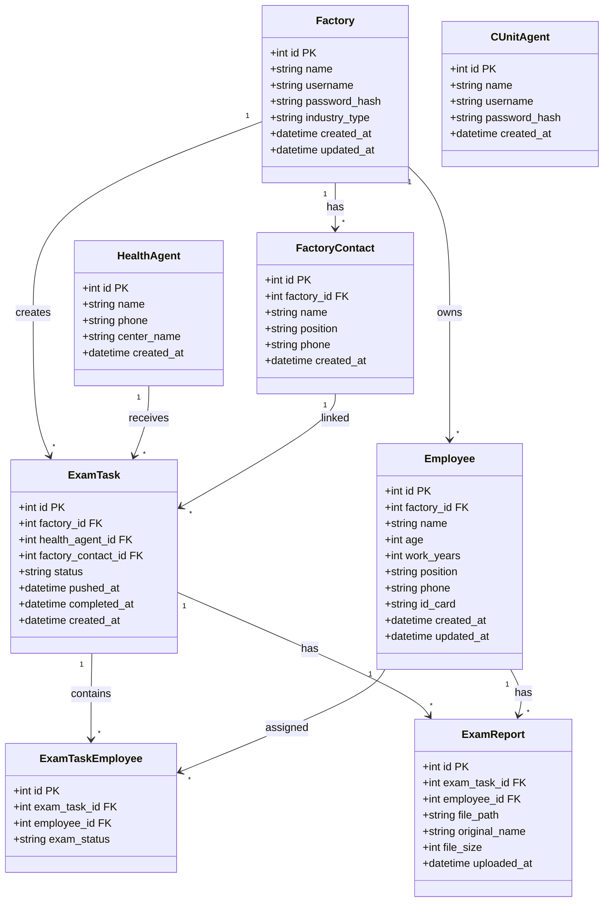
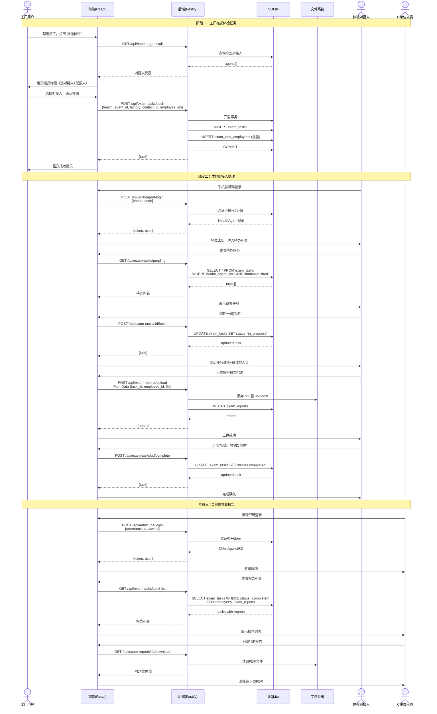
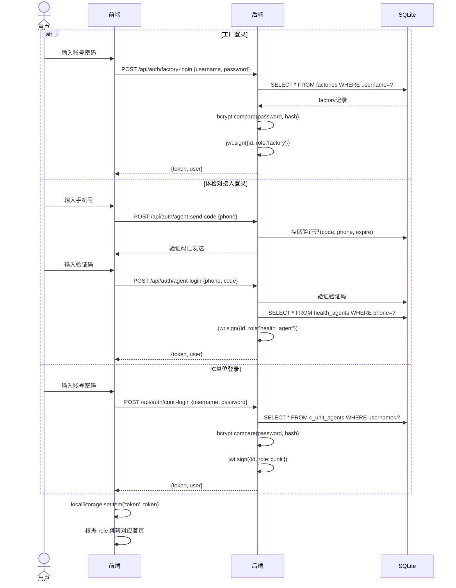
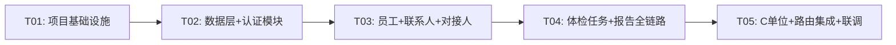

# 职业健康体检管理平台 — 系统架构设计

## 1. 实现方案与框架选型

### 1.1 核心技术挑战

| 挑战 | 解决方案 |
|------|----------|
| 三角色认证体系差异化（账号密码 vs 手机验证码 vs 账号密码） | 统一 JWT 认证，登录接口按角色分流，token 携带角色标识 |
| 对接人可见范围隔离（工厂只能看到绑定的对接人） | ExamTask 关联 Factory + HealthAgent，查询时 JOIN 过滤 |
| 手机验证码登录（无第三方短信网关预算） | 开发阶段用模拟验证码（固定 123456），接口预留真实短信接入点 |
| PDF 上传与绑定（报告关联员工+批次） | 文件存储本地 uploads/，数据库记录路径与关联关系 |
| 轻量部署（单机运行） | SQLite + 本地文件存储，零外部依赖 |

### 1.2 框架选型

| 层次 | 技术 | 理由 |
|------|------|------|
| 前端 | Vite + React 18 + MUI 5 + Tailwind CSS | 快速开发，组件丰富，响应式支持好 |
| 后端 | Node.js + Fastify | 比 Express 更快的 JSON 序列化，内置 schema 校验，适合 API 服务 |
| 数据库 | SQLite（better-sqlite3） | 零配置，单文件部署，事务支持完整 |
| 文件存储 | 本地文件系统（uploads/） | 简单可靠，无需 OSS |
| 认证 | JWT（jsonwebtoken） | 无状态，适合三角色统一认证 |
| 路由 | React Router v6 | 前端路由，支持角色路由守卫 |

### 1.3 架构模式

- **前端**：SPA + 角色路由守卫，三角色各自独立路由分组
- **后端**：分层架构 Controller → Service → Repository，中间件统一鉴权
- **整体**：前后端分离，REST API 通信

---

## 2. 文件列表及相对路径

### 2.1 后端文件

```
server/
├── package.json
├── .env
├── index.js                          # 应用入口，Fastify 初始化
├── db/
│   ├── init.js                       # 数据库初始化 + 建表
│   └── seed.js                       # 种子数据
├── middleware/
│   ├── auth.js                       # JWT 鉴权中间件
│   └── roleGuard.js                  # 角色权限守卫
├── routes/
│   ├── auth.js                       # 登录/验证码路由
│   ├── factory.js                    # 工厂相关路由
│   ├── employee.js                   # 员工 CRUD 路由
│   ├── factoryContact.js             # 工厂联系人路由
│   ├── healthAgent.js                # 体检中心对接人路由
│   ├── examTask.js                   # 体检任务路由
│   ├── examReport.js                 # 体检报告路由
│   └── cUnit.js                      # C单位路由
├── services/
│   ├── authService.js                # 认证服务
│   ├── employeeService.js            # 员工服务
│   ├── factoryContactService.js      # 工厂联系人服务
│   ├── examTaskService.js            # 体检任务服务
│   ├── examReportService.js          # 体检报告服务
│   └── notificationService.js        # 推送通知服务
├── repositories/
│   ├── factoryRepo.js                # 工厂数据访问
│   ├── employeeRepo.js               # 员工数据访问
│   ├── factoryContactRepo.js         # 联系人数据访问
│   ├── healthAgentRepo.js            # 对接人数据访问
│   ├── examTaskRepo.js               # 体检任务数据访问
│   ├── examReportRepo.js             # 体检报告数据访问
│   └── cUnitAgentRepo.js             # C单位数据访问
└── utils/
    ├── response.js                   # 统一响应格式
    ├── sms.js                        # 验证码发送（模拟）
    └── fileUpload.js                 # 文件上传工具
```

### 2.2 前端文件

```
client/
├── package.json
├── vite.config.js
├── tailwind.config.js
├── index.html
├── public/
│   └── favicon.ico
├── src/
│   ├── main.jsx                      # React 入口
│   ├── App.jsx                       # 根组件 + 路由
│   ├── theme.js                      # MUI 主题配置
│   ├── api/
│   │   ├── client.js                 # Axios 实例 + 拦截器
│   │   ├── auth.js                   # 认证 API
│   │   ├── employee.js               # 员工 API
│   │   ├── factoryContact.js         # 联系人 API
│   │   ├── examTask.js               # 体检任务 API
│   │   ├── examReport.js             # 体检报告 API
│   │   └── cUnit.js                  # C单位 API
│   ├── hooks/
│   │   ├── useAuth.js                # 认证 Hook
│   │   └── useRole.js                # 角色判断 Hook
│   ├── contexts/
│   │   └── AuthContext.jsx           # 认证上下文
│   ├── components/
│   │   ├── Layout.jsx                # 通用布局（侧边栏+顶栏）
│   │   ├── ProtectedRoute.jsx        # 路由守卫
│   │   ├── RoleRouter.jsx            # 角色路由分发
│   │   ├── ConfirmDialog.jsx         # 确认弹窗
│   │   └── FileUploader.jsx          # 文件上传组件
│   ├── pages/
│   │   ├── Login.jsx                 # 登录页
│   │   ├── factory/
│   │   │   ├── Dashboard.jsx         # 工厂首页
│   │   │   ├── EmployeeList.jsx      # 员工列表
│   │   │   ├── EmployeeForm.jsx      # 员工表单（新增/编辑）
│   │   │   ├── PushTaskDialog.jsx    # 推送体检弹窗
│   │   │   ├── PushHistory.jsx       # 推送历史
│   │   │   └── ContactManage.jsx     # 联系人管理
│   │   ├── healthAgent/
│   │   │   ├── Dashboard.jsx         # 体检中心首页
│   │   │   ├── TaskList.jsx          # 待办任务列表
│   │   │   ├── TaskDetail.jsx        # 任务详情
│   │   │   ├── ReportUpload.jsx      # 报告上传
│   │   │   ├── CompleteConfirm.jsx   # 完成确认
│   │   │   └── History.jsx           # 历史记录
│   │   └── cUnit/
│   │       ├── Dashboard.jsx         # C单位首页
│   │       ├── ReportList.jsx        # 报告列表
│   │       ├── EmployeeDetail.jsx    # 员工详情
│   │       └── ReportViewer.jsx      # 报告查看/下载
│   └── styles/
│       └── globals.css               # 全局样式 + Tailwind 指令
```

---

## 3. 数据结构与接口

### 3.1 数据模型类图



### 3.2 REST API 端点

#### 3.2.1 认证模块

| 方法 | 路径 | 请求体 | 响应体 | 说明 |
|------|------|--------|--------|------|
| POST | `/api/auth/factory-login` | `{username, password}` | `{code, data: {token, user}, message}` | 工厂登录 |
| POST | `/api/auth/agent-send-code` | `{phone}` | `{code, data: null, message}` | 发送验证码 |
| POST | `/api/auth/agent-login` | `{phone, code}` | `{code, data: {token, user}, message}` | 对接人登录 |
| POST | `/api/auth/cunit-login` | `{username, password}` | `{code, data: {token, user}, message}` | C单位登录 |
| GET | `/api/auth/me` | - | `{code, data: {id, role, name}, message}` | 获取当前用户 |

#### 3.2.2 员工管理（工厂）

| 方法 | 路径 | 请求体 | 响应体 | 说明 |
|------|------|--------|--------|------|
| GET | `/api/employees` | - (query: page, pageSize, keyword) | `{code, data: {list, total}, message}` | 员工列表 |
| GET | `/api/employees/:id` | - | `{code, data: employee, message}` | 员工详情 |
| POST | `/api/employees` | `{name, age, work_years, position, phone, id_card}` | `{code, data: employee, message}` | 新增员工 |
| PUT | `/api/employees/:id` | `{name, age, work_years, position, phone, id_card}` | `{code, data: employee, message}` | 编辑员工 |
| DELETE | `/api/employees/:id` | - | `{code, data: null, message}` | 删除员工 |

#### 3.2.3 工厂联系人管理

| 方法 | 路径 | 请求体 | 响应体 | 说明 |
|------|------|--------|--------|------|
| GET | `/api/factory-contacts` | - | `{code, data: [contacts], message}` | 联系人列表 |
| POST | `/api/factory-contacts` | `{name, position, phone}` | `{code, data: contact, message}` | 新增联系人 |
| PUT | `/api/factory-contacts/:id` | `{name, position, phone}` | `{code, data: contact, message}` | 编辑联系人 |
| DELETE | `/api/factory-contacts/:id` | - | `{code, data: null, message}` | 删除联系人 |

#### 3.2.4 体检对接人（查询可见范围）

| 方法 | 路径 | 请求体 | 响应体 | 说明 |
|------|------|--------|--------|------|
| GET | `/api/health-agents` | - | `{code, data: [agents], message}` | 获取对接人列表（工厂视角：仅已绑定的） |
| GET | `/api/health-agents/all` | - | `{code, data: [agents], message}` | 全部对接人（推送选择用） |

#### 3.2.5 体检任务

| 方法 | 路径 | 请求体 | 响应体 | 说明 |
|------|------|--------|--------|------|
| POST | `/api/exam-tasks/push` | `{health_agent_id, factory_contact_id, employee_ids: []}` | `{code, data: task, message}` | 工厂推送任务 |
| GET | `/api/exam-tasks/pushed` | - (query: page, pageSize) | `{code, data: {list, total}, message}` | 工厂推送历史 |
| GET | `/api/exam-tasks/pending` | - (query: page, pageSize) | `{code, data: {list, total}, message}` | 对接人待办任务 |
| GET | `/api/exam-tasks/:id` | - | `{code, data: task, message}` | 任务详情 |
| POST | `/api/exam-tasks/:id/fetch` | - | `{code, data: task, message}` | 对接人一键拉取任务 |
| POST | `/api/exam-tasks/:id/complete` | - | `{code, data: task, message}` | 对接人完成任务（推送C单位） |
| GET | `/api/exam-tasks/history` | - (query: page, pageSize) | `{code, data: {list, total}, message}` | 对接人历史记录 |
| GET | `/api/exam-tasks/cunit-list` | - (query: page, pageSize, status) | `{code, data: {list, total}, message}` | C单位任务/报告列表 |

#### 3.2.6 体检报告

| 方法 | 路径 | 请求体 | 响应体 | 说明 |
|------|------|--------|--------|------|
| POST | `/api/exam-reports/upload` | FormData: {task_id, employee_id, file} | `{code, data: report, message}` | 上传PDF报告 |
| GET | `/api/exam-reports/task/:taskId` | - | `{code, data: [reports], message}` | 任务下所有报告 |
| GET | `/api/exam-reports/:id` | - | `{code, data: report, message}` | 报告详情 |
| GET | `/api/exam-reports/:id/download` | - | PDF 文件流 | 下载报告PDF |
| DELETE | `/api/exam-reports/:id` | - | `{code, data: null, message}` | 删除报告 |

---

## 4. 程序调用流程

### 4.1 核心业务流程时序图：工厂推送 → 体检中心处理 → C单位查看



### 4.2 登录认证流程时序图



---

## 5. 任务列表

### T01: 项目基础设施（配置 + 入口 + 依赖声明）

**描述**：搭建前后端项目骨架，安装所有依赖，配置构建工具和数据库初始化。

**包含文件**：
- `server/package.json`, `server/.env`, `server/index.js`, `server/db/init.js`, `server/db/seed.js`
- `client/package.json`, `client/vite.config.js`, `client/tailwind.config.js`, `client/index.html`
- `client/src/main.jsx`, `client/src/App.jsx`, `client/src/theme.js`, `client/src/styles/globals.css`

**依赖**：无

**优先级**：P0

---

### T02: 数据层 + 认证模块

**描述**：实现所有 Repository 层数据访问、Service 层业务逻辑（认证为主），以及登录相关的路由、中间件和前端页面。

**包含文件**：
- `server/repositories/*.js`（全部7个Repo）
- `server/services/authService.js`
- `server/middleware/auth.js`, `server/middleware/roleGuard.js`
- `server/routes/auth.js`
- `server/utils/response.js`, `server/utils/sms.js`, `server/utils/fileUpload.js`
- `client/src/api/client.js`, `client/src/api/auth.js`
- `client/src/contexts/AuthContext.jsx`
- `client/src/hooks/useAuth.js`, `client/src/hooks/useRole.js`
- `client/src/components/Layout.jsx`, `client/src/components/ProtectedRoute.jsx`, `client/src/components/RoleRouter.jsx`
- `client/src/pages/Login.jsx`

**依赖**：T01

**优先级**：P0

---

### T03: 员工管理 + 联系人管理 + 对接人查询（工厂核心功能）

**描述**：实现工厂端的员工CRUD、联系人管理、对接人可见范围隔离逻辑，以及对应的前端页面。

**包含文件**：
- `server/services/employeeService.js`, `server/services/factoryContactService.js`
- `server/routes/employee.js`, `server/routes/factoryContact.js`, `server/routes/healthAgent.js`
- `client/src/api/employee.js`, `client/src/api/factoryContact.js`
- `client/src/components/ConfirmDialog.jsx`
- `client/src/pages/factory/Dashboard.jsx`, `client/src/pages/factory/EmployeeList.jsx`, `client/src/pages/factory/EmployeeForm.jsx`, `client/src/pages/factory/ContactManage.jsx`

**依赖**：T02

**优先级**：P0

---

### T04: 体检任务 + 报告上传（推送→处理→完成 全链路）

**描述**：实现体检任务推送、对接人拉取、报告上传、完成推送C单位的完整业务链路，以及体检中心前端页面和工厂推送弹窗。

**包含文件**：
- `server/services/examTaskService.js`, `server/services/examReportService.js`, `server/services/notificationService.js`
- `server/routes/examTask.js`, `server/routes/examReport.js`
- `client/src/api/examTask.js`, `client/src/api/examReport.js`
- `client/src/components/FileUploader.jsx`
- `client/src/pages/factory/PushTaskDialog.jsx`, `client/src/pages/factory/PushHistory.jsx`
- `client/src/pages/healthAgent/Dashboard.jsx`, `client/src/pages/healthAgent/TaskList.jsx`, `client/src/pages/healthAgent/TaskDetail.jsx`, `client/src/pages/healthAgent/ReportUpload.jsx`, `client/src/pages/healthAgent/CompleteConfirm.jsx`, `client/src/pages/healthAgent/History.jsx`

**依赖**：T03

**优先级**：P0

---

### T05: C单位模块 + 路由集成 + 最终联调

**描述**：实现C单位查看/下载报告功能，完成所有路由集成、角色路由守卫、端到端联调。

**包含文件**：
- `server/routes/cUnit.js`
- `client/src/api/cUnit.js`
- `client/src/pages/cUnit/Dashboard.jsx`, `client/src/pages/cUnit/ReportList.jsx`, `client/src/pages/cUnit/EmployeeDetail.jsx`, `client/src/pages/cUnit/ReportViewer.jsx`

**依赖**：T04

**优先级**：P0

---

## 6. 依赖包列表

### 6.1 后端（server/package.json）

```json
{
  "dependencies": {
    "fastify": "^4.26.0",
    "@fastify/cors": "^9.0.0",
    "@fastify/multipart": "^8.1.0",
    "@fastify/static": "^7.0.0",
    "better-sqlite3": "^11.0.0",
    "bcryptjs": "^2.4.3",
    "jsonwebtoken": "^9.0.2",
    "dotenv": "^16.4.0",
    "uuid": "^9.0.0"
  },
  "devDependencies": {
    "nodemon": "^3.1.0"
  }
}
```

### 6.2 前端（client/package.json）

```json
{
  "dependencies": {
    "react": "^18.2.0",
    "react-dom": "^18.2.0",
    "react-router-dom": "^6.22.0",
    "@mui/material": "^5.15.0",
    "@mui/icons-material": "^5.15.0",
    "@emotion/react": "^11.11.0",
    "@emotion/styled": "^11.11.0",
    "axios": "^1.6.0",
    "dayjs": "^1.11.0"
  },
  "devDependencies": {
    "@vitejs/plugin-react": "^4.2.0",
    "vite": "^5.1.0",
    "tailwindcss": "^3.4.0",
    "postcss": "^8.4.0",
    "autoprefixer": "^10.4.0"
  }
}
```

---

## 7. 共享知识（跨文件约定）

### 7.1 API 响应格式

```json
{
  "code": 0,
  "data": {},
  "message": "success"
}
```

- `code: 0` 成功，`code: -1` 业务错误，`code: 401` 未认证，`code: 403` 无权限
- 所有接口统一此格式

### 7.2 JWT Token 结构

```json
{
  "id": 1,
  "role": "factory" | "health_agent" | "cunit",
  "name": "xxx",
  "iat": 1234567890,
  "exp": 1234654290
}
```

- Token 有效期 24 小时
- 前端存储在 localStorage，请求时 `Authorization: Bearer <token>`

### 7.3 数据库约定

- 所有表使用自增整数主键 `id INTEGER PRIMARY KEY AUTOINCREMENT`
- 时间字段使用 ISO 8601 格式字符串 `DATETIME DEFAULT CURRENT_TIMESTAMP`
- 软删除不使用，直接物理删除（简单优先）
- 外键约束在 init.js 中通过 SQL 声明，better-sqlite3 开启 `PRAGMA foreign_keys = ON`

### 7.4 命名规范

- **后端文件**：camelCase（`examTaskService.js`）
- **后端类/函数**：camelCase（`getEmployeeById`）
- **数据库表/列**：snake_case（`exam_tasks`, `health_agent_id`）
- **前端组件**：PascalCase（`EmployeeList.jsx`）
- **前端工具函数**：camelCase（`formatDate`）
- **CSS 类**：Tailwind 原子类优先，自定义类用 kebab-case
- **API 路径**：kebab-case（`/api/exam-tasks`）、路径参数用 camelCase

### 7.5 错误处理约定

- 后端：Service 层抛出 `new Error(message)`，Controller 层 try-catch 捕获并返回统一格式
- 前端：Axios 拦截器统一处理 401（跳转登录）和全局错误提示
- 验证错误：返回 `code: -1`，message 描述具体原因

### 7.6 文件上传约定

- 上传目录：`server/uploads/reports/`
- 文件命名：`{taskId}_{employeeId}_{timestamp}.pdf`
- 文件大小限制：20MB
- 仅允许 PDF 格式

### 7.7 对接人可见范围隔离规则

- **工厂推送时**：可从全部对接人中选择（GET `/api/health-agents/all`）
- **推送成功后**：工厂只能看到已建立任务关系的对接人（GET `/api/health-agents` 通过 ExamTask JOIN 过滤）
- **体检对接人**：只能看到分配给自己的任务（WHERE health_agent_id = current_user.id）
- **C单位**：只能看到 status='completed' 的任务

### 7.8 分页约定

- 请求参数：`page`（从1开始）、`pageSize`（默认20）
- 响应格式：`{list: [], total: number, page: number, pageSize: number}`

---

## 8. 待明确事项

| # | 问题 | 当前假设 | 影响范围 |
|---|------|----------|----------|
| 1 | 手机验证码是否需要接入真实短信网关？ | 开发阶段用模拟验证码（固定123456），预留接口 | `server/utils/sms.js` |
| 2 | 一个工厂是否可同时推送多个对接人？ | 是，每次推送选一个对接人，可多次推送不同对接人 | ExamTask 设计 |
| 3 | 体检报告是否需要一个员工多份报告？ | 是，ExamReport 独立关联 employee_id + task_id | ExamReport 设计 |
| 4 | C单位是否需要审核/退回报告？ | P0 不需要，仅查看下载 | C单位路由 |
| 5 | 工厂是否可撤回已推送的任务？ | P0 不支持，推送后不可撤回 | examTaskService |
| 6 | 并发部署需求？ | 单实例部署，无需考虑并发 | 架构决策 |
| 7 | 数据备份策略？ | SQLite 文件定期备份，P0 不做自动备份 | 运维文档 |

---

## 9. 任务依赖图



---

## 10. 数据库建表 SQL

```sql
-- 工厂表
CREATE TABLE IF NOT EXISTS factories (
  id INTEGER PRIMARY KEY AUTOINCREMENT,
  name TEXT NOT NULL,
  username TEXT NOT NULL UNIQUE,
  password_hash TEXT NOT NULL,
  industry_type TEXT DEFAULT '',
  created_at DATETIME DEFAULT CURRENT_TIMESTAMP,
  updated_at DATETIME DEFAULT CURRENT_TIMESTAMP
);

-- 工厂联系人表
CREATE TABLE IF NOT EXISTS factory_contacts (
  id INTEGER PRIMARY KEY AUTOINCREMENT,
  factory_id INTEGER NOT NULL,
  name TEXT NOT NULL,
  position TEXT DEFAULT '',
  phone TEXT NOT NULL,
  created_at DATETIME DEFAULT CURRENT_TIMESTAMP,
  FOREIGN KEY (factory_id) REFERENCES factories(id) ON DELETE CASCADE
);

-- 员工表
CREATE TABLE IF NOT EXISTS employees (
  id INTEGER PRIMARY KEY AUTOINCREMENT,
  factory_id INTEGER NOT NULL,
  name TEXT NOT NULL,
  age INTEGER DEFAULT 0,
  work_years INTEGER DEFAULT 0,
  position TEXT DEFAULT '',
  phone TEXT DEFAULT '',
  id_card TEXT NOT NULL,
  created_at DATETIME DEFAULT CURRENT_TIMESTAMP,
  updated_at DATETIME DEFAULT CURRENT_TIMESTAMP,
  FOREIGN KEY (factory_id) REFERENCES factories(id) ON DELETE CASCADE
);

-- 体检中心对接人表
CREATE TABLE IF NOT EXISTS health_agents (
  id INTEGER PRIMARY KEY AUTOINCREMENT,
  name TEXT NOT NULL,
  phone TEXT NOT NULL UNIQUE,
  center_name TEXT DEFAULT '',
  created_at DATETIME DEFAULT CURRENT_TIMESTAMP
);

-- 体检任务表
CREATE TABLE IF NOT EXISTS exam_tasks (
  id INTEGER PRIMARY KEY AUTOINCREMENT,
  factory_id INTEGER NOT NULL,
  health_agent_id INTEGER NOT NULL,
  factory_contact_id INTEGER DEFAULT NULL,
  status TEXT NOT NULL DEFAULT 'pushed' CHECK(status IN ('pushed', 'in_progress', 'completed')),
  pushed_at DATETIME DEFAULT CURRENT_TIMESTAMP,
  completed_at DATETIME DEFAULT NULL,
  created_at DATETIME DEFAULT CURRENT_TIMESTAMP,
  FOREIGN KEY (factory_id) REFERENCES factories(id),
  FOREIGN KEY (health_agent_id) REFERENCES health_agents(id),
  FOREIGN KEY (factory_contact_id) REFERENCES factory_contacts(id)
);

-- 体检任务-员工关联表
CREATE TABLE IF NOT EXISTS exam_task_employees (
  id INTEGER PRIMARY KEY AUTOINCREMENT,
  exam_task_id INTEGER NOT NULL,
  employee_id INTEGER NOT NULL,
  exam_status TEXT NOT NULL DEFAULT 'pending' CHECK(exam_status IN ('pending', 'examined')),
  FOREIGN KEY (exam_task_id) REFERENCES exam_tasks(id) ON DELETE CASCADE,
  FOREIGN KEY (employee_id) REFERENCES employees(id) ON DELETE CASCADE
);

-- 体检报告表
CREATE TABLE IF NOT EXISTS exam_reports (
  id INTEGER PRIMARY KEY AUTOINCREMENT,
  exam_task_id INTEGER NOT NULL,
  employee_id INTEGER NOT NULL,
  file_path TEXT NOT NULL,
  original_name TEXT NOT NULL,
  file_size INTEGER DEFAULT 0,
  uploaded_at DATETIME DEFAULT CURRENT_TIMESTAMP,
  FOREIGN KEY (exam_task_id) REFERENCES exam_tasks(id) ON DELETE CASCADE,
  FOREIGN KEY (employee_id) REFERENCES employees(id) ON DELETE CASCADE
);

-- C单位人员表
CREATE TABLE IF NOT EXISTS c_unit_agents (
  id INTEGER PRIMARY KEY AUTOINCREMENT,
  name TEXT NOT NULL,
  username TEXT NOT NULL UNIQUE,
  password_hash TEXT NOT NULL,
  created_at DATETIME DEFAULT CURRENT_TIMESTAMP
);

-- 验证码临时表
CREATE TABLE IF NOT EXISTS sms_codes (
  id INTEGER PRIMARY KEY AUTOINCREMENT,
  phone TEXT NOT NULL,
  code TEXT NOT NULL,
  expire_at DATETIME NOT NULL,
  created_at DATETIME DEFAULT CURRENT_TIMESTAMP
);

PRAGMA foreign_keys = ON;
```
