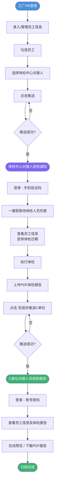

# 职业健康体检管理平台 PRD

**文档版本**：v1.0  
**创建日期**：2026-06-03  
**产品经理**：许清楚（Xu）  
**项目代号**：occupational_health_platform  

---

## 1. 产品目标

| # | 目标 | 说明 |
|---|------|------|
| G1 | **数字化串联三方协作** | 打通工厂→体检中心→职业卫生托管单位（C单位）的体检任务全链路，消除纸质/口头传递 |
| G2 | **提升体检任务流转效率** | 实现员工信息一次录入、多步推送，体检报告自动归档，减少重复手工操作 |
| G3 | **保障数据安全与权限隔离** | 工厂只可见自己选择的对接人，各角色数据权限严格隔离，防止信息越权访问 |

---

## 2. 用户角色与权限矩阵

### 2.1 角色定义

| 角色 | 英文标识 | 账号数量 | 登录方式 |
|------|----------|----------|----------|
| 工厂单位 | `factory` | 多账号（每家工厂独立） | 账号 + 密码 |
| 体检中心对接人 | `health_center_agent` | 多人（多个对接人） | 手机绑定 + 验证码 |
| C单位对接人员 | `c_unit_agent` | 指定人员账号 | 账号 + 密码 |

### 2.2 权限矩阵

| 功能模块 | 工厂单位 | 体检中心对接人 | C单位对接人员 |
|----------|----------|----------------|---------------|
| 录入/编辑员工信息 | ✅ | ❌ | ❌ |
| 录入/编辑工厂联系人 | ✅ | ❌ | ❌ |
| 查看本厂员工列表 | ✅ | ❌ | ❌ |
| 勾选员工并推送体检任务 | ✅ | ❌ | ❌ |
| 选择体检中心对接人 | ✅（仅见自选的1人） | ❌ | ❌ |
| 获取/查看推送的体检人员 | ❌ | ✅（仅本人任务） | ❌ |
| 安排体检 | ❌ | ✅ | ❌ |
| 上传PDF体检报告 | ❌ | ✅ | ❌ |
| 标记体检完成并推送C单位 | ❌ | ✅ | ❌ |
| 查看员工信息（含推送过来的） | ❌ | ✅（任务范围内） | ✅ |
| 查看/下载体检报告PDF | ❌ | ✅（上传方） | ✅ |
| 系统管理（账号、角色配置） | ❌ | ❌ | ❌（由超管） |

> **说明**：超级管理员账号（运营方）负责创建和管理各角色账号，不在本业务流程内详述。

---

## 3. 用户故事

### 3.1 工厂单位

| # | 用户故事 |
|---|----------|
| F-01 | 作为**工厂HR**，我希望能在系统中批量录入或导入员工基本信息，以便统一管理体检名单 |
| F-02 | 作为**工厂HR**，我希望勾选指定员工后选择一个体检中心对接人进行推送，以便灵活指定承接方 |
| F-03 | 作为**工厂HR**，我希望推送后系统只展示我选择的那位对接人信息，以便避免信息混乱 |
| F-04 | 作为**工厂管理员**，我希望能录入本厂联系人（职位、电话等），以便体检中心联系沟通 |
| F-05 | 作为**工厂HR**，我希望查看每次推送的历史记录及状态，以便跟踪员工体检进度 |

### 3.2 体检中心对接人

| # | 用户故事 |
|---|----------|
| H-01 | 作为**体检中心对接人**，我希望登录后一键获取所有工厂推送给我的待体检人员名单，以便快速了解本期工作量 |
| H-02 | 作为**体检中心对接人**，我希望为每批人员记录体检安排信息（日期、批次等），以便合理排期 |
| H-03 | 作为**体检中心对接人**，我希望体检完成后上传对应的PDF体检报告附件，以便与记录绑定存档 |
| H-04 | 作为**体检中心对接人**，我希望点击"完成"后系统自动将报告和员工信息推送给C单位，以便免去手动发送 |
| H-05 | 作为**体检中心对接人**，我希望查看历史体检批次及其推送状态，以便追溯记录 |

### 3.3 C单位对接人员

| # | 用户故事 |
|---|----------|
| C-01 | 作为**C单位对接人员**，我希望能查看所有推送来的员工体检信息，以便归档管理 |
| C-02 | 作为**C单位对接人员**，我希望能在线预览并下载体检报告PDF，以便做职业卫生台账 |
| C-03 | 作为**C单位对接人员**，我希望按工厂、时间筛选体检记录，以便快速定位目标员工信息 |

---

## 4. 需求池

### P0 - 必须有（核心业务流程）

| ID | 功能模块 | 功能描述 |
|----|----------|----------|
| P0-01 | 账号体系 | 三角色账号登录（工厂：账号密码；体检对接人：手机验证码；C单位：账号密码） |
| P0-02 | 员工信息管理 | 工厂录入员工：姓名、年龄、工龄、岗位、联系方式、身份证号码 |
| P0-03 | 工厂联系人管理 | 工厂录入联系人：职位名称、电话等 |
| P0-04 | 推送体检任务 | 工厂勾选员工 → 选择体检中心对接人 → 点击推送 |
| P0-05 | 对接人可见范围隔离 | 工厂只能看到并选择已绑定自己的体检中心对接人 |
| P0-06 | 体检中心获取任务 | 对接人登录后一键拉取推送给自己的待体检人员列表 |
| P0-07 | 上传体检报告 | 对接人上传PDF报告文件，与对应员工/批次绑定 |
| P0-08 | 完成推送至C单位 | 对接人点击"完成"，系统自动将报告+员工信息推送至C单位指定对接人 |
| P0-09 | C单位查看与下载报告 | C单位对接人员查看员工信息及下载PDF体检报告 |

### P1 - 应该有（体验提升）

| ID | 功能模块 | 功能描述 |
|----|----------|----------|
| P1-01 | 推送历史记录 | 工厂查看每次推送记录及当前状态（已推送/体检中/已完成） |
| P1-02 | 体检批次管理 | 体检中心对接人按批次管理多家工厂的体检任务 |
| P1-03 | 多文件报告上传 | 支持同一批次上传多个PDF文件 |
| P1-04 | 消息通知 | 关键节点（推送成功/体检完成/报告已送达）站内或短信通知 |
| P1-05 | 报告在线预览 | C单位可在线预览PDF，无需下载 |
| P1-06 | 数据筛选/搜索 | 按工厂名称、员工姓名、时间段筛选体检记录 |
| P1-07 | 员工批量导入 | 支持Excel模板批量导入员工信息 |

### P2 - 可以有（锦上添花）

| ID | 功能模块 | 功能描述 |
|----|----------|----------|
| P2-01 | 体检到期预警 | 系统根据工龄/岗位自动提醒即将到期的体检员工 |
| P2-02 | 数据统计看板 | 工厂/C单位可查看体检完成率、覆盖人数等统计图表 |
| P2-03 | 操作日志 | 记录关键操作日志（推送、上传、下载），供审计使用 |
| P2-04 | 报告有效期管理 | 记录体检日期，标记报告有效期状态 |

---

## 5. UI 页面设计说明

### 5.1 工厂单位页面

| 页面名称 | 路由 | 功能说明 |
|----------|------|----------|
| 登录页 | `/login` | 账号+密码登录，带工厂标识 |
| 员工列表 | `/employees` | 表格展示全部员工，支持搜索、筛选；顶部有"新增员工""批量导入""推送"按钮 |
| 员工新增/编辑 | `/employees/form` | 表单录入：姓名、年龄、工龄、岗位、联系方式、身份证号码 |
| 推送弹窗 | （modal） | 确认勾选人员 → 下拉选择体检中心对接人（仅展示可见的1位）→ 确认推送 |
| 推送历史 | `/push-history` | 展示推送批次列表、推送时间、接收对接人、状态（已推送/体检中/已完成） |
| 工厂联系人管理 | `/contacts` | 新增/编辑工厂联系人：职位名称、电话等 |

### 5.2 体检中心对接人页面

| 页面名称 | 路由 | 功能说明 |
|----------|------|----------|
| 登录页 | `/login` | 手机号 + 验证码登录 |
| 待办任务列表 | `/tasks` | 展示所有待处理的体检任务，按工厂/推送时间分组；顶部"一键获取最新推送"按钮 |
| 任务详情 | `/tasks/:id` | 查看本批次员工名单（姓名、岗位、联系方式等）、安排体检日期 |
| 报告上传 | （task详情内） | 上传PDF报告文件（支持多文件），与员工记录关联 |
| 完成确认 | （task详情内） | 点击"完成并推送C单位"按钮，二次确认后提交 |
| 历史记录 | `/history` | 查看已完成批次列表，可查看/下载报告 |

### 5.3 C单位对接人员页面

| 页面名称 | 路由 | 功能说明 |
|----------|------|----------|
| 登录页 | `/login` | 账号+密码登录 |
| 体检报告列表 | `/reports` | 展示所有已推送报告，支持按工厂、时间、员工姓名筛选 |
| 员工详情 | `/reports/:id` | 查看单个员工完整信息（基础信息 + 岗位 + 体检记录） |
| 报告查看/下载 | （详情内） | 在线预览PDF（iFrame或PDF.js）；提供下载按钮 |

### 5.4 公共页面

| 页面名称 | 说明 |
|----------|------|
| 404 / 无权限页 | 越权访问时跳转 |
| 个人信息/修改密码 | 各角色均可修改自身账号信息 |

---

## 6. 数据字段说明

### 6.1 工厂（Factory）

| 字段名 | 类型 | 说明 |
|--------|------|------|
| id | UUID | 主键 |
| name | String | 工厂名称 |
| account | String | 登录账号 |
| password_hash | String | 密码哈希 |
| bound_agent_id | UUID | 绑定的体检中心对接人ID（工厂只可见此人） |
| created_at | DateTime | 创建时间 |

### 6.2 工厂联系人（FactoryContact）

| 字段名 | 类型 | 说明 |
|--------|------|------|
| id | UUID | 主键 |
| factory_id | UUID | 所属工厂 |
| name | String | 联系人姓名 |
| title | String | 职位名称 |
| phone | String | 电话 |

### 6.3 员工（Employee）

| 字段名 | 类型 | 说明 |
|--------|------|------|
| id | UUID | 主键 |
| factory_id | UUID | 所属工厂 |
| name | String | 姓名 |
| id_card | String | 身份证号码（需加密存储） |
| age | Integer | 年龄 |
| work_years | Float | 工龄（年） |
| position | String | 岗位 |
| phone | String | 联系方式 |
| created_at | DateTime | 录入时间 |
| updated_at | DateTime | 最后更新时间 |

### 6.4 体检中心对接人（HealthAgent）

| 字段名 | 类型 | 说明 |
|--------|------|------|
| id | UUID | 主键 |
| name | String | 姓名 |
| phone | String | 绑定手机号（唯一） |
| health_center_name | String | 所属体检中心名称 |
| created_at | DateTime | 注册时间 |

### 6.5 体检任务批次（ExamTask）

| 字段名 | 类型 | 说明 |
|--------|------|------|
| id | UUID | 主键 |
| factory_id | UUID | 发起工厂 |
| agent_id | UUID | 接收体检中心对接人 |
| push_time | DateTime | 工厂推送时间 |
| scheduled_date | Date | 安排体检日期（对接人填写） |
| status | Enum | `pushed` / `in_progress` / `completed` |
| completed_at | DateTime | 完成时间 |
| pushed_to_c_at | DateTime | 推送至C单位时间 |

### 6.6 体检任务员工关联（ExamTaskEmployee）

| 字段名 | 类型 | 说明 |
|--------|------|------|
| id | UUID | 主键 |
| task_id | UUID | 关联任务批次 |
| employee_id | UUID | 关联员工 |

### 6.7 体检报告（ExamReport）

| 字段名 | 类型 | 说明 |
|--------|------|------|
| id | UUID | 主键 |
| task_id | UUID | 关联任务批次 |
| employee_id | UUID | 关联员工（可选，若报告按批次整体上传则为空） |
| file_name | String | 原始文件名 |
| file_path | String | 存储路径（OSS/本地） |
| file_size | Integer | 文件大小（bytes） |
| uploaded_by | UUID | 上传人（对接人ID） |
| uploaded_at | DateTime | 上传时间 |

### 6.8 C单位对接人员（CUnitAgent）

| 字段名 | 类型 | 说明 |
|--------|------|------|
| id | UUID | 主键 |
| name | String | 姓名 |
| account | String | 登录账号 |
| password_hash | String | 密码哈希 |

---

## 7. 业务流程图

---

## 8. 待确认问题

| # | 问题 | 影响范围 | 优先级 |
|---|------|----------|--------|
| Q1 | **工厂与对接人的绑定关系是固定的还是可变的？** 即工厂推送时是否可以每次选择不同的对接人，还是由超管预先绑定且固定不变？ | 推送逻辑、权限隔离设计 | 高 |
| Q2 | **C单位对接人员是一人还是多人？** 若多人，报告是推送给全部C单位人员还是指定某一人？ | C单位账号体系、推送逻辑 | 高 |
| Q3 | **体检报告是按员工个人上传还是按批次整体上传？** 影响报告与员工的对应关系设计 | 报告数据模型、下载体验 | 高 |
| Q4 | **是否需要超级管理员角色？** 用于管理工厂账号创建、对接人绑定配置等后台操作 | 账号体系完整性 | 中 |
| Q5 | **员工信息中身份证号是否需要脱敏展示（如 `34****1234`）？** 涉及隐私合规 | 数据安全方案 | 中 |
| Q6 | **体检报告PDF存储方案**：使用云OSS还是本地文件服务器？ | 技术选型、成本 | 中 |
| Q7 | **是否需要短信/站内通知**（如推送成功、报告完成提醒）？ | P1功能范围 | 低 |
| Q8 | **多个体检中心对接人之间是否有数据隔离要求？** 即对接人A是否可以看到对接人B的任务？ | 权限模型 | 中 |

---

*文档结束 - occupational_health_platform PRD v1.0*
